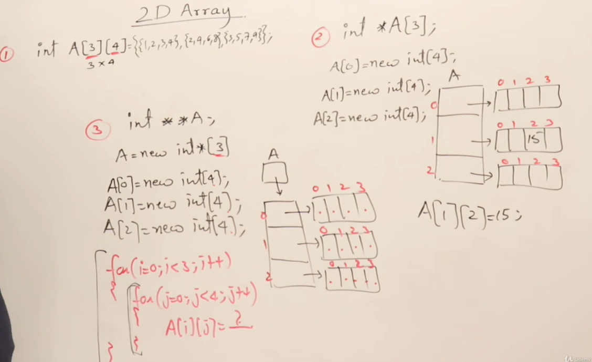
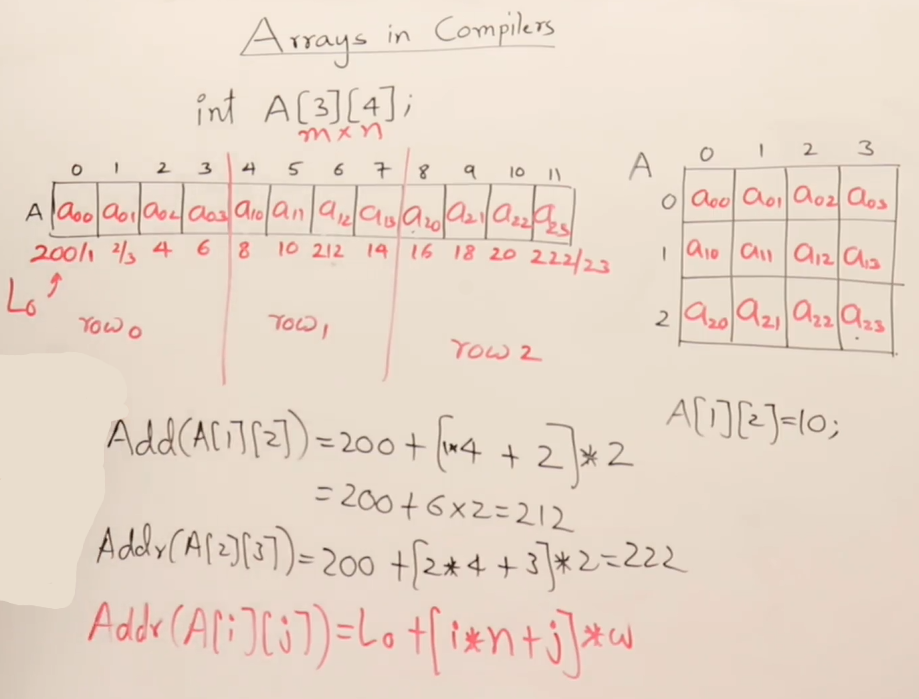
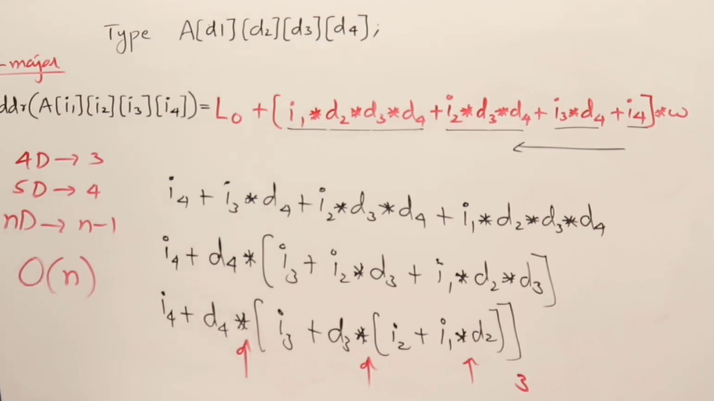

 # **Accessing 2-D & n-D Arrays Elements** using 3 Methods mentioned below
 - ### 1) Using Normal 2D Array
 - ### 2) Using One Pointer and linking it to multiple Arrays (Combination of both Pointer and Array)
 - ### 3) Using only pointers

 

 # How address of element in Array is Obtained by the compiler?
 ## It can be obtained by the following formula

                    A[i]=L0+i*w

    where, L0 = Starting address of the Array
           i = Element Index in Array
           w = DataType word size of that Array

    example: A[4]=200+4*2 = 208 which is the Address of A[4]


```diff

- Key Point: Start with index i=0 every time to save execution time for larger arrays

```

# **Row & Column Major Matrix**

## **Definition:** A matrix represented in a 1D Array
Row Major Matrix can be represented using the formula 
    
### **Row Major Matrix Formula**  

    addr ( A [ i ] [ j ] ) = L0 + [ i * n + j] * w

### **Column Major Matrix Formula**  

    addr ( A [ i ] [ j ] ) = L0 + [ j * m + i] * w

 


# **Formula for n-D array using Row major**

$$ 
addr(A([i_{1}] [i_{2}] [i_{3}] [i_{4}])) = L_{0} + [i_{1} * d_{2} * d_{3} * d_{4} + i_{2} * d_{3} * d_{4} + i_{3} * d_{4} + i_{4}]
$$

## General Formula:

$$
addr(A([i_{1}] [i_{2}] [i_{3}] [i_{4}])) = L_{0} + \sum_{p=1}^n [ i_{p} * \pi_{q=p+1}^n d_{q}] * w
$$

using the above formula the time complexity is O(n^2)

## **More faster way** - Time Complextiy: O(n) - (using Horners Rule)

 
