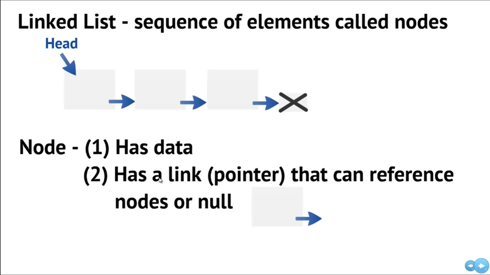
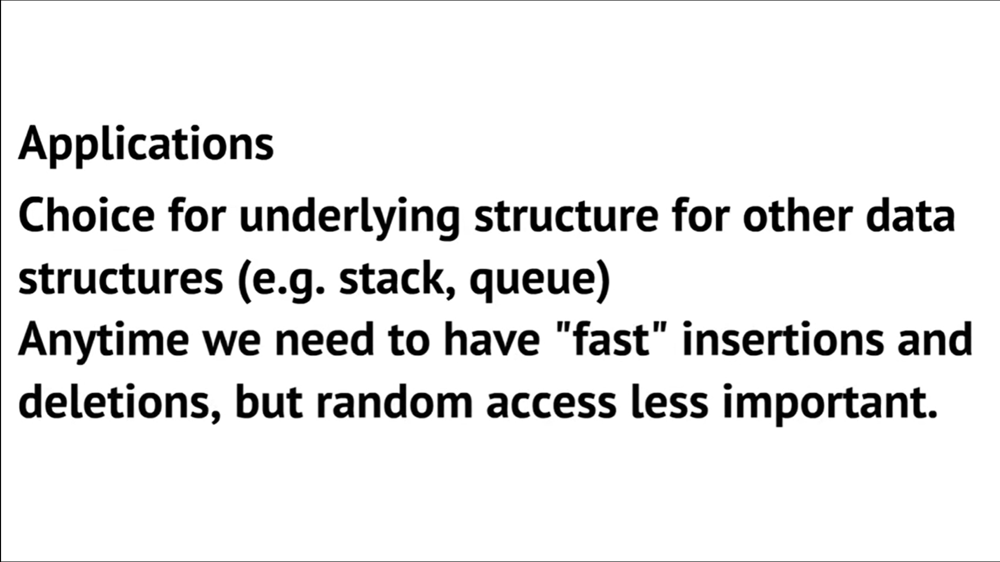

# Linked List 
##### (Easy to grasp the concept once you struggle in the starting)
## **Basics of Linked List**
### **Linked List** is a collection of nodes which contains data and link to next node
### Linked List is created in Heap 


## **Advantages/Disadvantages of Linked Lists**


## **Applications of Linked List** 

</br>
</br>
</br>

## **Node contents**
```cpp
class Node{
    public:
        int data;           //data of the node
        Node *next;  //link to next node where the next node is also of type node 
}
```
</br>

## **Adding a node at the front**
### it is a 4 step process:
1) Allocate/create an empty node (new_node)
2) Put data into the new_node
3) Make the next of the new_node as the head
4) move the head to point to new_node

```cpp
//here Node is ** because it is a poniter which is pointing to the head pointer
    void push(Node** head_ref,int new_data)
    {
        Node new_node = new Node(); // step 1
        new_node->data = new_data;  // step 2
        new_node->next = *head_ref; // step 3 
        *head_ref = new_node;       // step 4
    }
```

</br>

## **Inserting the node after a given position**
### it is a 5 step process:
1) Check whether the previosu node is empty ,if empty exit
2) Allocate/create an empty node (new_node)
3) Put data into the new_node
4) Make the next of the new_node as next of previous node
5) move the next of previous node to new_node

```cpp
void insert_after(Node* prev_node,int new_data)
{
    if(prev_node == NULL)
    {
        cout<<"given previous node is null";
        return;
    }

    Node* new_node = new Node();
    new_node->data = new_data;
    new_node->next = prev_node->next;
    prev_node->next = new_node;

}
```