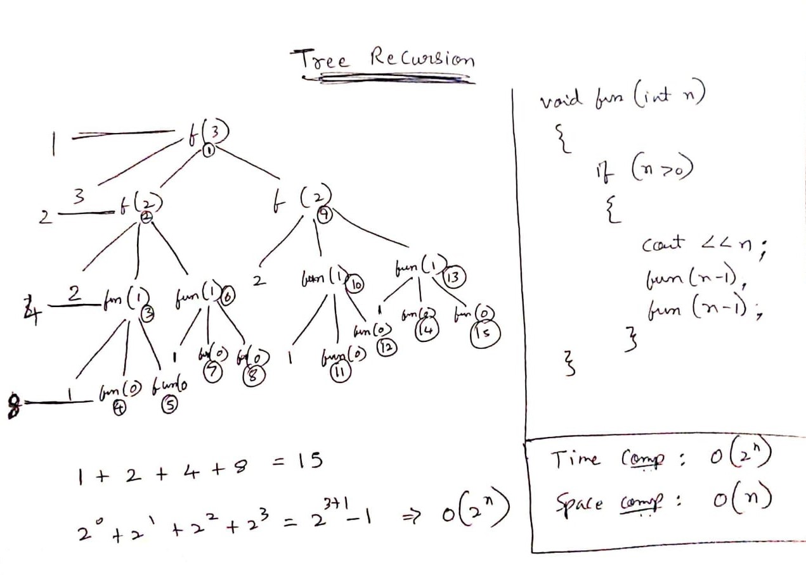

# Types of Recursion

* ### Tail Recursion
* ### Head Recursion
* ### Tree Recursion
* ### Indirect Recursion (Cont. **Day7**)
* ### Nested Recursion  (Cont. **Day7**)


## **Tail Recursion**

### The recursive function which is called after executing all the statements given to it.


### This means that all these operations will performed at calling time only and the function will not be performing any operation at a returning time.

```cpp
fun(n)
{
    if(n>0)
    {
        --------
        ---------
        ----------
        fun(n-1);   //Tail Recursion
    }
}
```

## **Head Recursion**

### The function doesn't have to process or perform any operation at the time of calling. It has to do everything only at the time of returning.

```cpp
fun(n)
{
    if(n>0)
    {
        fun(n-1);   //Head Recursion
        --------
        ---------
        ----------
    }
}
```

## **Tree Recursion**

### If the Recursive Function is called more than one time , then it is known as recursive function.
```cpp
fun(n)
{
    if(n>0)
    {
        --------
        ---------
        ----------
        fun(n-1);       //Tree Recursion
        --------
        ---------
        ----------
        fun(n-1);
        --------
        ---------
        ----------
    }
}
```

